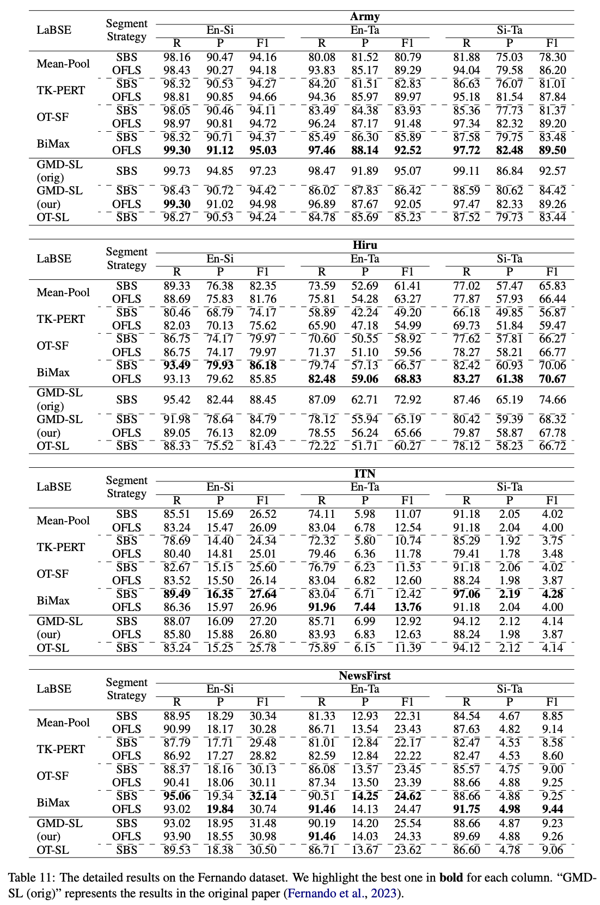

# BiMax: Bidirectional MaxSim Score for Document-Level Alignment
This **EmbDA** repository contains all the document alignment methods we used in the paper.
- **Mean-Pool**
- **TK-PERT**
- **OT (Optimal Transport)**: Implement using the Python library [POT](https://pythonot.github.io).
- **GMD (Greedy Movers' Distance)**: Part of the code refers to [Fernando et al.](https://github.com/nlpcuom/parallel_corpus_mining/blob/master/document_alignment/GreedyMoversDistance.py).
- **BiMax**: Loop or Batch

This repository includes the source codes of paper [Document Alignment based on Overlapping Fixed-Length Segments](https://aclanthology.org/2024.acl-srw.10/) for the implementation of **OFLS**.

Part of the implementation of **GMD** is from [Fernando et al.](https://github.com/nlpcuom/parallel_corpus_mining/blob/master/document_alignment/GreedyMoversDistance.py).


## Prerequisite
- Environment: See `environment.yml`.
- Dataset: We list the [Fernando Dataset](https://github.com/kdissa/comparable-corpus) used in the paper in our github repository.
  - The dataset is placed in `fernando_data/` directory.
  - If you'd like to use this dataset in your research, please cite their [paper](https://link.springer.com/article/10.1007/s10115-022-01761-x).

## Generate Embeddings
**Quick Start**: Run `main/00.generate_embs.sh` to generate embeddings.
``` shell
cd ./main
sh 00.generate_embs.sh
``` 
Modify the parameters `LANG`, `DATA_DOMAIN`, and `SPLIT_METHOD` in the shell file to generate embeddings using the **OFLS** or **SBS** for different languages across the various domains.

**Note**: When setting `DATA_DOMAIN`, please pay attention to case sensitivity.
``` shell
#!/bin/bash

LANG=en                    # Lang, choose from [en, si, ta]
DATA_DOMAIN=Army      # Data domain, choose from [Newsfirst, ITN, Army, Hiru]

TKPERT_J=16                # J for TK-PERT
TKPER_SHAPE=20             # Shape for TK-PERT

SPLIT_METHOD=ofls          # Split method, choose from [sbs, ofls]
# if ofls has been chosen
FL=30                      # Fixed-Length for ofls
OVERLAP=0.5                # Overlapping Rate for ofls

DATA_PATH=../fernando_data
OUT_PATH=../embs             # Path to save the embeddings
mkdir -p $OUT_PATH

CHUNK_SIZE=2048              # Chunk size used to split document segments into batches for embedding
SAVE_NUM=4096                # Document Num. for saving in one embedding file


echo "Begin generating embeddings..."
python ../utils/generate_embs.py    --seg_len $FL --overlap $OVERLAP --split_method $SPLIT_METHOD \
                                    --J $TKPERT_J --shape $TKPER_SHAPE \
                                    --lang $LANG \
                                    --data_domain $DATA_DOMAIN \
                                    --data_path $DATA_PATH \
                                    --out_path $OUT_PATH \
                                    --chunk_size $CHUNK_SIZE \
                                    --save_num $SAVE_NUM
``` 

## Pipeline: Retrieval, Formatting, and Evaluation
`main/01.pipeline.sh` is a pipeline that integrates retrieval, result formatting, and evaluation. Individual components can be used separately if needed.
``` shell
sh 01.pipeline.sh
``` 
To use this pipeline, please configure the following:
- Source language `SRC_LANG`
- Target language `TGT_LANG`
- Data domain `DATA_DOMAIN`
- Segmentation strategy `SPLIT_METHOD`
- **Document alignment method** `DA_METHOD`
  - Choose `[mean, tkpert]` to only use Mean-Pool or TK-PERT
  - Choose `mean-[sf, sl]-[ot, gmd]` to use Mean-Pool vectors as retrieval embeddings, with:
    - "sf" or "sl" as weighting scheme
    - OT or GMD for alignment
  - Choose `mean-bimax` to use BiMax
    - If BiMax is chosen, please set `BIMAX_TYPE`
    - **Note**: **Loop** vs. **Batch** Mode
	  - The difference between Loop and Batch lies only in speed (not accuracy).
	  - **Loop mode** (the method used in the paper) performs similarity computation on each document pair sequentially using a for loop.
	  - **Batch mode** computes multiple document pairs simultaneously, which requires more memory but is faster.
- Similarity computation method when using Mean-Pool or TK-PERT `SIM_METHOD`
  - Please choose from "cos" and "margin"
- Search Strategy using FAISS `SEARCH_TYPE`
- Number of candidates for FAISS search `CAND_NUM`

**Note**: Ensure that the necessary embeddings are ready before running the pipeline.

The default settings correspond to the parameters used in the paper.
``` shell
#!/bin/bash

EMBS_PATH=../embs
OUT_PATH=../da_results
DATA_PATH=../fernando_data

mkdir -p $OUT_PATH

SRC_LANG=en               # Source Language
TGT_LANG=si               # Target Language

DA_METHOD=mean-bimax    
# Document alignment method, choose from [mean, tkpert, mean-[sl, sf]-[ot, gmd] (e.g., mean-sf-ot), mean-bimax]

# If "bimax" has been chosen
BIMAX_TYPE=loop            # Calculation type of BiMax, choose from [loop, batch] 

SIM_METHOD=cos             # Retrieval strategy for "mean" or "tkpert", choose from [cos, margin]
SPLIT_METHOD=ofls          # Segmentation method, choose from [ofls, sbs]
DATA_DOMAIN=Army            # Data domain, choose from [Newsfirst, ITN, Army, Hiru]
# If "ofls" has been chosen
FL=30                      # Fixed-Length for OFLS
OR=0.5                     # Overlapping Rate for OFLS

CAND_NUM=32                # Maximum candidate number for each source doucment using faiss search
SEARCH_TYPE=cos            # Search type using faiss, choose from [cos, L2]

LANG_PAIR=${SRC_LANG}-${TGT_LANG}

...
``` 
The execution results are as follows.
``` 
There are 1 GPU(s) available.
We will use the GPU: NVIDIA H100 PCIe
1 [en] embedding files have been found!
1 [si] embedding files have been found!
Begin loading [en] data file [0]...
Begin loading [si] data file [0]...
Begin calculating similarity scores...
Finish calculating similarities in 3.5583994388580322 seconds!

Run all the program in 53.62904167175293 sec...

All the work has been done!

Begining turning output file to result file...
Have turned output file to result file!
TP: 1836
FP: 179
FN: 12
Recall: 99.30%
Precision: 91.12%
F1: 95.03%
``` 
Please check and compare with the results in our paper.
<p align="center">

<p>

## Document Alignment methods
If you only want to use the different document alignment methods:
- For the construction of vectors with **Mean-Pool** and **TK-PERT**, please refer to `utils/generate_embs.py`.
- For **OT**, **GMD**, and **BiMax**, please refer to the documentation of the function parameters and return values in `utils/da_methods.py`.

## Citation
If you find our paper and code helpful in your research, please cite our paper:

``` bibtex
@misc{wang2025bimaxbidirectionalmaxsimscore,
      title={BiMax: Bidirectional MaxSim Score for Document-Level Alignment}, 
      author={Xiaotian Wang and Takehito Utsuro and Masaaki Nagata},
      year={2025},
      eprint={2510.15577},
      archivePrefix={arXiv},
      primaryClass={cs.CL},
      url={https://arxiv.org/abs/2510.15577}, 
}
``` 

## Contact Us
If you have any questions about the our paper or codes, please contact us via email or simply post an issue.
